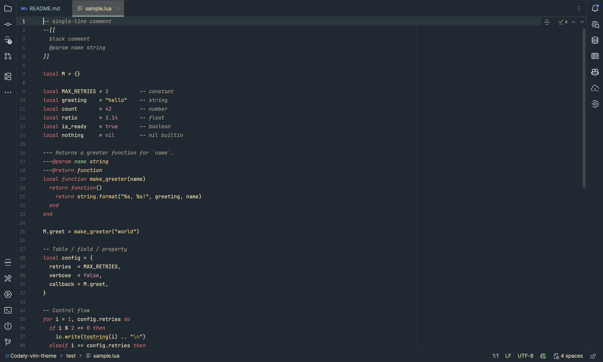
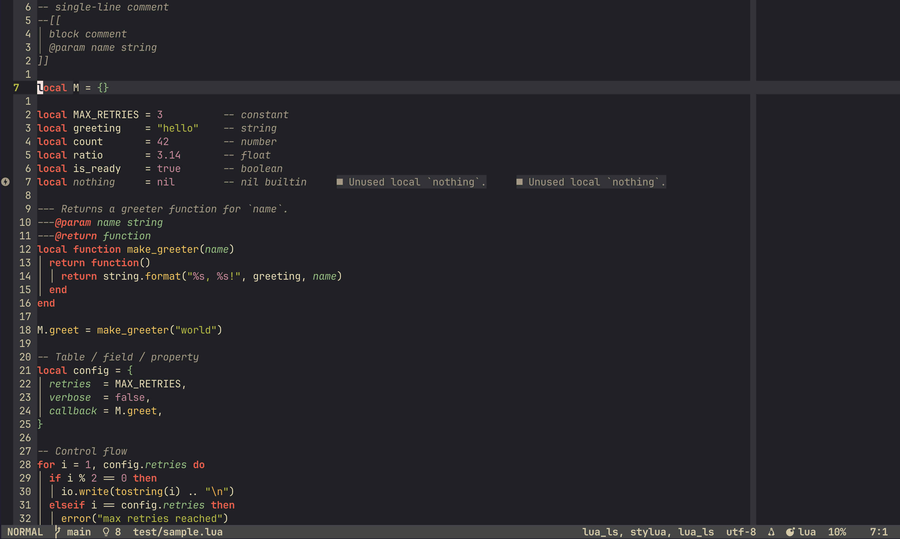

# Codely Neovim Theme


A port of the official [Codely](https://codely.com) colorscheme originally designed for JetBrains IntelliJ  to Vim and Neovim. Same palette, same semantic color roles, full support for the modern Neovim plugin stack.

## Preview

| IntelliJ                             | Neovim                        |
|--------------------------------------|-------------------------------|
|  |  |

## Color Palette

| Variable | Hex | Semantic role |
|----------|-----|---------------|
| `s:bg` |  `#202124` | Background |
| `s:fg` |  `#EBDBB2` | Foreground / normal text |
| `s:fg2` | `#d8c9a4` | Secondary text |
| `s:fg3` | `#c5b896` | Tertiary text / separators |
| `s:fg4` | `#b3a687` | Line numbers / decorations |
| `s:bg2` | `#323336` | Cursor line / popup bg |
| `s:bg3` | `#444547` | Status line / selection bg |
| `s:bg4` | `#565659` | Non-text / indent guides |
| `s:keyword` |  `#fb5245` | Keywords (`if`, `for`, `return`) |
| `s:builtin` |  `#FAC149` | Built-in functions / decorators |
| `s:const` |  `#D3869B` | Constants / booleans / numbers |
| `s:comment` |  `#A89984` | Comments |
| `s:func` | `#FAC149` | Function names |
| `s:str` |  `#B8BB26` | String literals |
| `s:type` |  `#8EC07C` | Types / classes / identifiers |
| `s:var` | `#EBDBB2` | Variables (same as fg) |
| `s:warning` |  `#F0A732` | Warnings |
| `s:warning2` | `#F49810` | Errors / MatchParen |

## Features

- Full **TreeSitter** highlight captures (`@keyword`, `@function`, `@type`, `@tag`, `@diff.*`, and more)
- **LSP Diagnostics** — Error, Warn, Info, Hint with underline, virtual text, and sign column variants
- **LSP Semantic Tokens** (`@lsp.type.*`, `@lsp.mod.deprecated`) for Neovim ≥ 0.9
- Plugin support: **Telescope**, **nvim-cmp**, **Gitsigns**, **NeoTree**, **NvimTree**, **indent-blankline**, **WhichKey**, **Mini.nvim**
- Compatible with **classic Vim ≥ 8.2** and **Neovim ≥ 0.8** — pure Vim Script, zero dependencies
- Terminal colors configured via `g:terminal_color_*`

## Installation

### lazy.nvim

```lua
{
  dir = "~/path/to/Codely-vim-theme",
  name = "Codely",
  priority = 1000,
  config = function()
    vim.cmd.colorscheme("Codely")
  end,
}
```

Or from GitHub once published:

```lua
{
  "wall3n/Codely-vim-theme",
  priority = 1000,
  config = function()
    vim.cmd.colorscheme("Codely")
  end,
}
```

### packer.nvim

```lua
use {
  "wall3n/Codely-vim-theme",
  config = function()
    vim.cmd("colorscheme Codely")
  end,
}
```

### Manual

```bash
git clone https://github.com/wall3n/Codely-vim-theme \
  ~/.local/share/nvim/site/pack/codely/start/Codely-vim-theme
```

Then add to your config:

```vim
colorscheme Codely
```

## Configuration

Minimum `init.lua`:

```lua
vim.opt.termguicolors = true
vim.cmd.colorscheme("Codely")
```

Or using the Lua module:

```lua
require("codely").setup()
```

## Lualine Integration

```lua
local c = {
  bg      = "#202124",
  fg      = "#EBDBB2",
  bg2     = "#323336",
  bg3     = "#444547",
  fg2     = "#d8c9a4",
  keyword = "#fb5245",
  str     = "#B8BB26",
  const   = "#D3869B",
  warning = "#F0A732",
  builtin = "#FAC149",
  type    = "#8EC07C",
}

require("lualine").setup({
  options = {
    theme = {
      normal   = { a = { bg = c.keyword, fg = c.bg,  gui = "bold" }, b = { bg = c.bg3, fg = c.fg  }, c = { bg = c.bg2, fg = c.fg2 } },
      insert   = { a = { bg = c.str,     fg = c.bg,  gui = "bold" }, b = { bg = c.bg3, fg = c.fg  }, c = { bg = c.bg2, fg = c.fg2 } },
      visual   = { a = { bg = c.const,   fg = c.bg,  gui = "bold" }, b = { bg = c.bg3, fg = c.fg  }, c = { bg = c.bg2, fg = c.fg2 } },
      replace  = { a = { bg = c.warning, fg = c.bg,  gui = "bold" }, b = { bg = c.bg3, fg = c.fg  }, c = { bg = c.bg2, fg = c.fg2 } },
      command  = { a = { bg = c.builtin, fg = c.bg,  gui = "bold" }, b = { bg = c.bg3, fg = c.fg  }, c = { bg = c.bg2, fg = c.fg2 } },
      inactive = { a = { bg = c.bg2,     fg = c.fg2             },   b = { bg = c.bg2, fg = c.fg2 }, c = { bg = c.bg2, fg = c.fg2 } },
    },
  },
})
```

## Roadmap

- [ ] Additional language-specific groups: TypeScript, Rust, C/C++, Kotlin, Elixir
- [ ] Native Lua rewrite (`lua/codely/`) for faster load and Neovim-only distributions
- [ ] Automatic `lualine` theme export via `require("codely").lualine_theme()`
- [ ] Light variant based on `codely_light.xml`

## Inspiration & Reference

- [Codely JetBrains theme](https://github.com/CodelyTV/codely-jetbrains-theme) — original design, color tokens exported under `reference/`
- [Codely VSCode theme](https://github.com/CodelyTV/vscode-codely-theme) — VSCode variant
- Color roles and naming conventions from [Gruvbox](https://github.com/morhetz/gruvbox)

## License

MIT — see [LICENSE](LICENSE).

The color palette and visual design are original work by [Codely](https://github.com/CodelyTV). This repository is an independent Vim/Neovim port and is not officially maintained by Codely.
